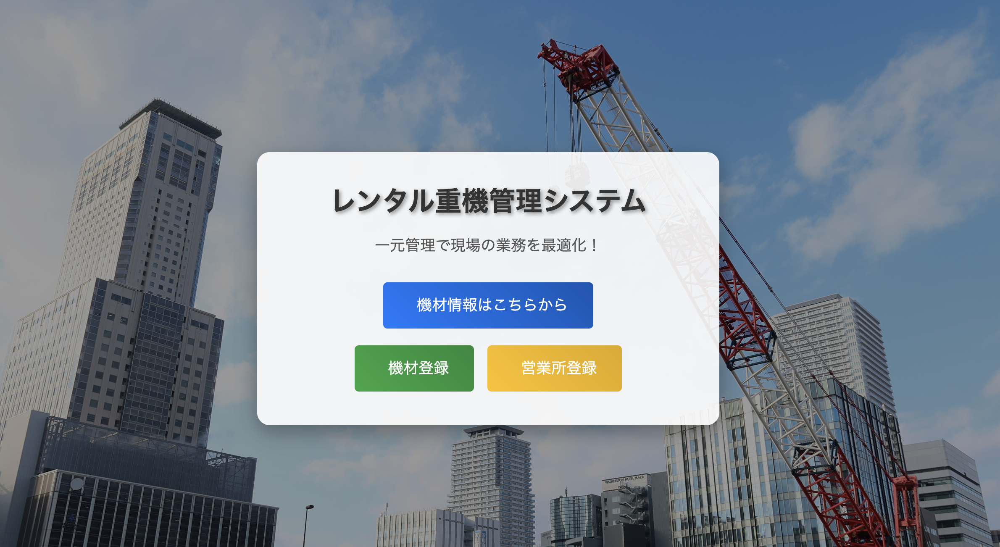

## デモURL
実際の操作画面は、以下のリンクからアクセスできます。  

[レンタル重機管理システム](http://RentalMachineManagerALB-381945711.ap-northeast-1.elb.amazonaws.com)  

## システム　概要
本システムは、機材のレンタル状況や営業所情報を管理し、営業所間でのリアルタイムな情報共有を実現することを目的としています。

### 開発背景

#### 従来の課題
- 各営業所が機材の貸し出し状況を個別に管理しており、他営業所の在庫状況を即時に確認できない。　
- 電話やメールでの確認が必要で、対応に時間がかかるため機会損失が発生する。

#### 本システムの導入による改善
- **リアルタイムな在庫確認**  
  本システムを導入し、営業所間でリアルタイムに機材のレンタル状況を確認可能に。  

- **貸し出し管理の効率化**  
  レンタル状況を可視化し、スムーズな機材管理を実現。  

- **データの整合性を確保**  
  機材情報と営業所情報を一元管理し、正確なデータ運用が可能に。    

## 主な機能

| 機能 | 詳細 |
|------|------------------------------------------------|
| 機材の検索・一覧表示 | 機材名、メーカー、型式、ステータス、営業所でフィルタリング可能 |
| 機材の詳細表示 | 機材の詳細情報（メーカー・型式・現在のレンタル状況、営業所情報）を確認可能 |
| 機材の登録・編集・削除 | 機材情報（機材名・メーカー・型式・ステータス・営業所）の登録・更新・削除 |
| 営業所の登録・管理 | 営業所名と住所を記録・編集 |
| 機材のステータス管理 | 「レンタル中」「利用可能」「メンテナンス中」などの状態表示 |

## 使用技術
| 分類 | 技術・ツール |
|------|-------------|
| バックエンド | Java + Spring Boot |
| フロントエンド | Thymeleaf + Bootstrap |
| データベース | MySQL |
| インフラ | AWS（EC2, RDS, ALB, IAM） |
| ツール | MyBatis + GitHub + intellij IDEA + VS Code  |

## 使用イメージ
### 機材一覧ページ
#### 一覧表示
https://github.com/user-attachments/assets/769bb96e-30bc-49a7-af7a-10be275a4a17
#### 機材検索
https://github.com/user-attachments/assets/857ac6ee-3d73-4597-91fa-e7a69e0a9344
#### 機材編集
https://github.com/user-attachments/assets/58cc8403-7b8d-4a41-863a-544baa00b501
#### 機材削除
https://github.com/user-attachments/assets/d5aaebf7-5a82-4bd7-8d74-7804af233b44

### 新規機材登録ページ
#### 機材登録
https://github.com/user-attachments/assets/6e3ab846-68ad-4ab7-b173-3afb7efc19ea

### 新規営業所登録ページ
#### 営業所登録
https://github.com/user-attachments/assets/300054c7-0e22-4281-9bb2-916a0cb9a27c
#### 営業所編集
https://github.com/user-attachments/assets/111ecdb9-0f65-49ea-8ce8-3809a6834d52

## 設計書
### ER図

### インフラ構成図

